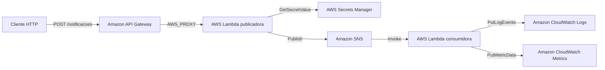

# Projeto 2: Do HTTP ao evento com uma aplicação serverless AWS completa no Floci

> Série: Laboratórios práticos com serviços AWS em ambiente local  
> Continuação: [Projeto 1: Como simular serviços AWS localmente com o Floci](./tutorial-floci-aws-local.md)  
> Nível: intermediário  
> Ambiente: Linux, WSL ou macOS com Docker  
> Conta AWS: não obrigatória  
> Linguagem utilizada: Python 3.13  
> Interface de gerenciamento: AWS CLI  
> Endpoint local: `http://localhost:4566`

## Certificações AWS relacionadas

Este laboratório pode ser utilizado como complemento prático para os estudos das seguintes certificações:

| Certificação | Código | Relação com o laboratório |
| --- | --- | --- |
| AWS Certified Cloud Practitioner | `CLF-C02` | Ajuda a compreender o propósito de serviços serverless, mensageria, segurança, monitoramento e gerenciamento de APIs. |
| AWS Certified Solutions Architect - Associate | `SAA-C03` | Trabalha integração assíncrona, desacoplamento, aplicações orientadas a eventos, Lambda, SNS e API Gateway. |
| AWS Certified Developer - Associate | `DVA-C02` | Possui relação direta com desenvolvimento de funções Lambda, integração com APIs, Secrets Manager, logs, métricas e tratamento de eventos. |
| AWS Certified CloudOps Engineer - Associate | `SOA-C03` | Reforça práticas de monitoramento, logging, métricas, alarmes, diagnóstico e operação de workloads AWS. |
| AWS Certified DevOps Engineer - Professional | `DOP-C02` | Serve como base para automação, observabilidade, testes locais, empacotamento e futura implantação por infraestrutura como código. |
| AWS Certified Solutions Architect - Professional | `SAP-C02` | Reforça conceitos de arquiteturas distribuídas, desacopladas e orientadas a eventos. |

> O laboratório complementa os estudos, mas não substitui o uso da documentação oficial, dos guias dos exames e de uma conta AWS real.

---

# 1. Continuidade da série

No primeiro projeto, construímos um laboratório local com Floci para praticar:

- Amazon S3;
- Amazon DynamoDB;
- Amazon SQS;
- AWS CLI;
- Docker Compose;
- armazenamento persistente;
- integração manual entre serviços.

Naquele momento, cada operação foi executada principalmente pela AWS CLI.

Criamos recursos, enviamos objetos, inserimos itens, publicamos mensagens e validamos os resultados manualmente.

Neste segundo projeto, evoluiremos para uma arquitetura orientada a eventos.

Em vez de chamar cada serviço manualmente, criaremos um fluxo no qual os serviços serão integrados:

```text
Cliente HTTP
     |
     v
Amazon API Gateway
     |
     v
AWS Lambda publicadora
     |
     +--> AWS Secrets Manager
     |
     v
Amazon SNS
     |
     v
AWS Lambda consumidora
     |
     +--> Amazon CloudWatch Logs
     |
     +--> Amazon CloudWatch Metrics
```

O novo laboratório apresentará principalmente os seguintes serviços:

- Amazon API Gateway;
- AWS Lambda;
- AWS IAM;
- AWS Secrets Manager;
- Amazon SNS;
- Amazon CloudWatch Logs;
- Amazon CloudWatch Metrics;
- AWS STS para validação da identidade local.

---

# 2. Objetivo do projeto

Construiremos uma API serverless para publicação de notificações.

O cliente enviará uma requisição HTTP como esta:

```json
{
  "tipo": "CERTIFICACAO",
  "destinatario": "jeferson",
  "mensagem": "Laboratório concluído com sucesso"
}
```

O processamento será:

1. O API Gateway receberá o `POST`.
2. O API Gateway invocará uma função Lambda.
3. A função consultará uma configuração no Secrets Manager.
4. A configuração indicará se a publicação está habilitada.
5. A função validará os dados recebidos.
6. A função publicará uma mensagem em um tópico SNS.
7. O SNS entregará o evento para uma segunda função Lambda.
8. A função consumidora registrará um evento no CloudWatch Logs.
9. A função consumidora publicará uma métrica no CloudWatch Metrics.
10. Os resultados serão consultados pela AWS CLI.

---

# 3. O que será aprendido

Ao concluir o laboratório, você terá praticado:

- criação de uma API REST;
- criação de recursos e métodos no API Gateway;
- integração `AWS_PROXY`;
- implantação de stage;
- invocação de API com `curl`;
- desenvolvimento de funções Lambda em Python;
- empacotamento de funções em ZIP;
- execução de funções em containers Docker;
- cold start e reutilização de containers;
- criação de papéis IAM;
- criação de trust policies;
- criação de políticas inline;
- princípio do menor privilégio;
- criação e versionamento de secrets;
- geração de senha aleatória;
- consulta de secrets dentro de uma Lambda;
- criação de tópico SNS;
- publicação de mensagens;
- uso de atributos de mensagens;
- assinatura de uma Lambda em um tópico;
- processamento de eventos SNS;
- criação de log groups;
- criação de log streams;
- publicação de logs estruturados;
- consulta e filtragem de logs;
- publicação de métricas personalizadas;
- consulta de estatísticas;
- criação de alarmes;
- simulação de estado de alarme;
- validação da persistência;
- atualização de código Lambda;
- tratamento de erros;
- troubleshooting;
- remoção controlada dos recursos.

---

# 4. Arquitetura lógica



## 4.1 Plano de controle e plano de dados

Neste laboratório, trabalharemos com dois tipos de operação.

### Plano de controle

Representa a criação e configuração dos recursos:

```text
CreateRestApi
CreateFunction
CreateRole
CreateSecret
CreateTopic
CreateLogGroup
PutMetricAlarm
```

### Plano de dados

Representa o uso efetivo dos recursos:

```text
POST /notificacoes
Invoke
GetSecretValue
Publish
PutLogEvents
PutMetricData
```

Essa separação ajuda a entender que criar uma API não significa necessariamente utilizá-la.

Primeiro configuramos o recurso. Depois enviamos tráfego para ele.

---

# 5. Serviços utilizados

## 5.1 Amazon API Gateway

O API Gateway será a porta de entrada HTTP.

Ele será responsável por:

- receber a requisição;
- identificar o método e o recurso;
- construir o evento Lambda;
- invocar a função publicadora;
- devolver a resposta ao cliente.

Neste projeto usaremos o API Gateway v1, também chamado de REST API.

## 5.2 AWS Lambda

Teremos duas funções:

```text
floci-notificacoes-publicadora
floci-notificacoes-consumidora
```

A função publicadora será síncrona do ponto de vista do cliente:

```text
Cliente -> API Gateway -> Lambda publicadora
```

A função consumidora será orientada a eventos:

```text
SNS -> Lambda consumidora
```

## 5.3 AWS Secrets Manager

O Secrets Manager armazenará a configuração:

```json
{
  "aplicacao": "floci-notificacoes",
  "ambiente": "laboratorio",
  "publicacao_habilitada": true,
  "token_integracao": "valor-gerado-aleatoriamente"
}
```

A função consultará o secret durante a execução.

## 5.4 Amazon SNS

O SNS será responsável por desacoplar a publicação do processamento.

A função publicadora conhecerá apenas o tópico. O tópico conhecerá seus assinantes.

## 5.5 Amazon CloudWatch Logs

O CloudWatch Logs armazenará registros estruturados sobre as notificações processadas.

## 5.6 Amazon CloudWatch Metrics

A função consumidora publicará métricas como:

```text
NotificacoesProcessadas
NotificacoesComErro
```

## 5.7 AWS IAM

Criaremos dois papéis:

```text
floci-role-notificacoes-publicadora
floci-role-notificacoes-consumidora
```

Cada função receberá somente as permissões necessárias.

---

# 6. Pré-requisitos

Tenha as seguintes ferramentas instaladas:

- Docker Engine ou Docker Desktop;
- Docker Compose v2;
- AWS CLI v2;
- `curl`;
- `jq`;
- `zip`;
- `unzip`;
- `sha256sum`;
- Python 3;
- terminal Bash.

## 6.1 Validar as ferramentas

```bash
docker --version
docker compose version
aws --version
curl --version
jq --version
zip -v | head -n 2
unzip -v | head -n 2
python3 --version
sha256sum --version | head -n 1
```

## 6.2 Confirmar acesso ao Docker

```bash
docker info >/dev/null && echo "OK: Docker operacional."
```

## 6.3 Confirmar o socket Docker

```bash
ls -l /var/run/docker.sock
```

## 6.4 Atenção de segurança

O socket Docker fornece um nível elevado de controle sobre o host.

Use este laboratório somente em estação de estudo, máquina pessoal ou ambiente autorizado.

---

# 7. Criar a estrutura do projeto

```bash
mkdir -p floci-serverless-parte-2/{src/publicadora,src/consumidora,build,config,policies,eventos,scripts}
cd floci-serverless-parte-2
```

Valide:

```bash
find . -maxdepth 2 -type d | sort
```

Estrutura esperada:

```text
floci-serverless-parte-2/
├── build/
├── compose.yaml
├── config/
├── eventos/
├── policies/
├── scripts/
└── src/
    ├── consumidora/
    └── publicadora/
```

---

# 8. Criar o arquivo Docker Compose

```bash
cat > compose.yaml <<'EOF'
services:
  floci:
    image: ${FLOCI_IMAGE:-floci/floci:latest}
    container_name: floci
    ports:
      - "4566:4566"
    environment:
      FLOCI_HOSTNAME: floci
      FLOCI_DEFAULT_REGION: us-east-1
      FLOCI_DEFAULT_ACCOUNT_ID: "000000000000"
      FLOCI_STORAGE_MODE: hybrid
      FLOCI_STORAGE_PERSISTENT_PATH: /app/data
      FLOCI_SERVICES_APIGATEWAY_ENABLED: "true"
      FLOCI_SERVICES_LAMBDA_ENABLED: "true"
      FLOCI_SERVICES_IAM_ENABLED: "true"
      FLOCI_SERVICES_STS_ENABLED: "true"
      FLOCI_SERVICES_SNS_ENABLED: "true"
      FLOCI_SERVICES_SECRETSMANAGER_ENABLED: "true"
      FLOCI_SERVICES_CLOUDWATCHLOGS_ENABLED: "true"
      FLOCI_SERVICES_CLOUDWATCHMETRICS_ENABLED: "true"
      FLOCI_SERVICES_LAMBDA_DEFAULT_MEMORY_MB: "256"
      FLOCI_SERVICES_LAMBDA_DEFAULT_TIMEOUT_SECONDS: "30"
      FLOCI_SERVICES_LAMBDA_CONTAINER_IDLE_TIMEOUT_SECONDS: "120"
      AWS_ACCESS_KEY_ID: test
      AWS_SECRET_ACCESS_KEY: test
      AWS_SESSION_TOKEN: test
      AWS_DEFAULT_REGION: us-east-1
      AWS_REGION: us-east-1
    volumes:
      - floci-data:/app/data
      - /var/run/docker.sock:/var/run/docker.sock
    healthcheck:
      test: ["CMD", "curl", "-fsS", "http://localhost:4566/_floci/health"]
      interval: 5s
      timeout: 3s
      retries: 30
      start_period: 10s
    restart: unless-stopped

volumes:
  floci-data:
EOF
```

## 8.1 Configurações principais

`FLOCI_HOSTNAME=floci` permite que os containers Lambda encontrem o endpoint do Floci pela rede Docker.

O volume `floci-data` mantém os recursos persistentes.

O socket Docker permite a criação dos containers usados para executar as funções.

---

# 9. Validar o arquivo Compose

```bash
docker compose config -q
echo "Código de retorno: $?"
```

Exiba a configuração resolvida:

```bash
docker compose config
```

---

# 10. Iniciar o Floci

```bash
docker compose pull
docker compose up -d
docker compose ps
```

Aguarde o estado saudável:

```bash
for tentativa in $(seq 1 30); do
  STATUS=$(docker inspect --format '{{if .State.Health}}{{.State.Health.Status}}{{else}}{{.State.Status}}{{end}}' floci 2>/dev/null || true)
  printf 'Tentativa %02d: %s\n' "$tentativa" "${STATUS:-indisponível}"

  if [ "$STATUS" = "healthy" ]; then
    echo "OK: Floci saudável."
    break
  fi

  sleep 2
done
```

Consulte:

```bash
curl -fsS http://localhost:4566/_floci/health | jq .
```

---

# 11. Configurar a AWS CLI

```bash
export AWS_ENDPOINT_URL=http://localhost:4566
export AWS_DEFAULT_REGION=us-east-1
export AWS_REGION=us-east-1
export AWS_ACCESS_KEY_ID=test
export AWS_SECRET_ACCESS_KEY=test
export AWS_SESSION_TOKEN=test
export AWS_PAGER=""
```

Confirme a identidade local:

```bash
aws sts get-caller-identity --endpoint-url "$AWS_ENDPOINT_URL"
```

---

# 12. Definir os nomes dos recursos

```bash
export ACCOUNT_ID=000000000000
export REGION=us-east-1
export SECRET_ID=/floci/notificacoes/config
export TOPIC_NAME=floci-notificacoes
export PUBLISHER_FUNCTION=floci-notificacoes-publicadora
export CONSUMER_FUNCTION=floci-notificacoes-consumidora
export PUBLISHER_ROLE=floci-role-notificacoes-publicadora
export CONSUMER_ROLE=floci-role-notificacoes-consumidora
export LOG_GROUP_NAME=/floci/notificacoes/consumidora
export LOG_STREAM_NAME=processamento-local
export METRIC_NAMESPACE=Floci/Notificacoes
export API_NAME=floci-api-notificacoes
export API_STAGE=dev
export ALARM_NAME=floci-notificacoes-certificacao
```

---

# 13. Criar a configuração no Secrets Manager

## 13.1 Gerar um token aleatório

```bash
TOKEN_INTERNO=$(aws secretsmanager get-random-password \
  --password-length 32 \
  --exclude-punctuation \
  --query 'RandomPassword' \
  --output text \
  --endpoint-url "$AWS_ENDPOINT_URL")

export TOKEN_INTERNO
```

## 13.2 Criar o arquivo do secret

```bash
jq -n \
  --arg aplicacao "floci-notificacoes" \
  --arg ambiente "laboratorio" \
  --arg token "$TOKEN_INTERNO" \
  '{
    aplicacao: $aplicacao,
    ambiente: $ambiente,
    publicacao_habilitada: true,
    token_integracao: $token
  }' > config/secret-ativo.json
```

## 13.3 Criar ou atualizar o secret

```bash
if aws secretsmanager describe-secret \
  --secret-id "$SECRET_ID" \
  --endpoint-url "$AWS_ENDPOINT_URL" >/dev/null 2>&1; then

  aws secretsmanager put-secret-value \
    --secret-id "$SECRET_ID" \
    --secret-string file://config/secret-ativo.json \
    --endpoint-url "$AWS_ENDPOINT_URL"
else
  aws secretsmanager create-secret \
    --name "$SECRET_ID" \
    --description "Configuração da API serverless local com Floci" \
    --secret-string file://config/secret-ativo.json \
    --tags Key=Projeto,Value=FlociParte2 Key=Ambiente,Value=Laboratorio \
    --endpoint-url "$AWS_ENDPOINT_URL"
fi
```

## 13.4 Obter o ARN

```bash
SECRET_ARN=$(aws secretsmanager describe-secret \
  --secret-id "$SECRET_ID" \
  --query 'ARN' \
  --output text \
  --endpoint-url "$AWS_ENDPOINT_URL")

export SECRET_ARN
```

## 13.5 Consultar o valor

```bash
aws secretsmanager get-secret-value \
  --secret-id "$SECRET_ID" \
  --query 'SecretString' \
  --output text \
  --endpoint-url "$AWS_ENDPOINT_URL" | jq .
```

## 13.6 Consultar metadados

```bash
aws secretsmanager describe-secret \
  --secret-id "$SECRET_ID" \
  --endpoint-url "$AWS_ENDPOINT_URL" | jq .
```

## 13.7 Consultar versões

```bash
aws secretsmanager list-secret-version-ids \
  --secret-id "$SECRET_ID" \
  --endpoint-url "$AWS_ENDPOINT_URL" | jq .
```

---

# 14. Criar o tópico SNS

```bash
TOPIC_ARN=$(aws sns create-topic \
  --name "$TOPIC_NAME" \
  --tags Key=Projeto,Value=FlociParte2 Key=Ambiente,Value=Laboratorio \
  --query 'TopicArn' \
  --output text \
  --endpoint-url "$AWS_ENDPOINT_URL")

export TOPIC_ARN
```

Valide:

```bash
aws sns get-topic-attributes \
  --topic-arn "$TOPIC_ARN" \
  --endpoint-url "$AWS_ENDPOINT_URL" | jq .
```

---

# 15. Criar o destino no CloudWatch Logs

## 15.1 Criar o log group

```bash
aws logs create-log-group \
  --log-group-name "$LOG_GROUP_NAME" \
  --tags Projeto=FlociParte2 Ambiente=Laboratorio \
  --endpoint-url "$AWS_ENDPOINT_URL" 2>/dev/null || true
```

## 15.2 Configurar retenção

```bash
aws logs put-retention-policy \
  --log-group-name "$LOG_GROUP_NAME" \
  --retention-in-days 7 \
  --endpoint-url "$AWS_ENDPOINT_URL"
```

## 15.3 Criar o log stream

```bash
aws logs create-log-stream \
  --log-group-name "$LOG_GROUP_NAME" \
  --log-stream-name "$LOG_STREAM_NAME" \
  --endpoint-url "$AWS_ENDPOINT_URL" 2>/dev/null || true
```

## 15.4 Publicar um log manual

```bash
TIMESTAMP_MS=$(date +%s%3N)

aws logs put-log-events \
  --log-group-name "$LOG_GROUP_NAME" \
  --log-stream-name "$LOG_STREAM_NAME" \
  --log-events "[{\"timestamp\":${TIMESTAMP_MS},\"message\":\"LABORATORIO_INICIADO\"}]" \
  --endpoint-url "$AWS_ENDPOINT_URL"
```

## 15.5 Consultar o log

```bash
aws logs get-log-events \
  --log-group-name "$LOG_GROUP_NAME" \
  --log-stream-name "$LOG_STREAM_NAME" \
  --start-from-head \
  --endpoint-url "$AWS_ENDPOINT_URL" | jq .
```

---

# 16. Criar a trust policy das funções

```bash
cat > policies/lambda-trust-policy.json <<'EOF'
{
  "Version": "2012-10-17",
  "Statement": [
    {
      "Sid": "PermitirLambdaAssumirRole",
      "Effect": "Allow",
      "Principal": {
        "Service": "lambda.amazonaws.com"
      },
      "Action": "sts:AssumeRole"
    }
  ]
}
EOF
```

---

# 17. Criar o papel da Lambda publicadora

```bash
aws iam create-role \
  --role-name "$PUBLISHER_ROLE" \
  --description "Role da Lambda publicadora do laboratório Floci" \
  --assume-role-policy-document file://policies/lambda-trust-policy.json \
  --tags Key=Projeto,Value=FlociParte2 Key=Funcao,Value=Publicadora \
  --endpoint-url "$AWS_ENDPOINT_URL" 2>/dev/null || true

PUBLISHER_ROLE_ARN=$(aws iam get-role \
  --role-name "$PUBLISHER_ROLE" \
  --query 'Role.Arn' \
  --output text \
  --endpoint-url "$AWS_ENDPOINT_URL")

export PUBLISHER_ROLE_ARN
```

---

# 18. Criar a política da Lambda publicadora

```bash
cat > policies/publicadora-policy.json <<EOF
{
  "Version": "2012-10-17",
  "Statement": [
    {
      "Sid": "LerConfiguracao",
      "Effect": "Allow",
      "Action": [
        "secretsmanager:GetSecretValue",
        "secretsmanager:DescribeSecret"
      ],
      "Resource": "${SECRET_ARN}"
    },
    {
      "Sid": "PublicarNotificacao",
      "Effect": "Allow",
      "Action": ["sns:Publish"],
      "Resource": "${TOPIC_ARN}"
    },
    {
      "Sid": "EscreverLogsBasicos",
      "Effect": "Allow",
      "Action": [
        "logs:CreateLogGroup",
        "logs:CreateLogStream",
        "logs:PutLogEvents"
      ],
      "Resource": "*"
    }
  ]
}
EOF

aws iam put-role-policy \
  --role-name "$PUBLISHER_ROLE" \
  --policy-name FlociNotificacoesPublicadoraPolicy \
  --policy-document file://policies/publicadora-policy.json \
  --endpoint-url "$AWS_ENDPOINT_URL"
```

---

# 19. Criar o papel da Lambda consumidora

```bash
aws iam create-role \
  --role-name "$CONSUMER_ROLE" \
  --description "Role da Lambda consumidora do laboratório Floci" \
  --assume-role-policy-document file://policies/lambda-trust-policy.json \
  --tags Key=Projeto,Value=FlociParte2 Key=Funcao,Value=Consumidora \
  --endpoint-url "$AWS_ENDPOINT_URL" 2>/dev/null || true

CONSUMER_ROLE_ARN=$(aws iam get-role \
  --role-name "$CONSUMER_ROLE" \
  --query 'Role.Arn' \
  --output text \
  --endpoint-url "$AWS_ENDPOINT_URL")

export CONSUMER_ROLE_ARN
```

---

# 20. Criar a política da Lambda consumidora

```bash
cat > policies/consumidora-policy.json <<'EOF'
{
  "Version": "2012-10-17",
  "Statement": [
    {
      "Sid": "GerenciarLogsDaAplicacao",
      "Effect": "Allow",
      "Action": [
        "logs:CreateLogGroup",
        "logs:CreateLogStream",
        "logs:DescribeLogGroups",
        "logs:DescribeLogStreams",
        "logs:PutLogEvents"
      ],
      "Resource": "*"
    },
    {
      "Sid": "PublicarMetricas",
      "Effect": "Allow",
      "Action": ["cloudwatch:PutMetricData"],
      "Resource": "*"
    }
  ]
}
EOF

aws iam put-role-policy \
  --role-name "$CONSUMER_ROLE" \
  --policy-name FlociNotificacoesConsumidoraPolicy \
  --policy-document file://policies/consumidora-policy.json \
  --endpoint-url "$AWS_ENDPOINT_URL"
```

---

# 21. Entender o princípio do menor privilégio

A função publicadora precisa consultar o secret e publicar no SNS.

A consumidora precisa escrever logs e métricas.

Separar as permissões reduz o impacto de credenciais comprometidas e facilita auditoria.

---

# 22. Criar a função Lambda publicadora

```bash
cat > src/publicadora/app.py <<'PYTHON'
import base64
import json
import os
import uuid
from datetime import datetime, timezone
from typing import Any

import boto3
from botocore.exceptions import BotoCoreError, ClientError

AWS_ENDPOINT_URL = os.environ.get("AWS_ENDPOINT_URL")
AWS_REGION = os.environ.get("AWS_REGION", "us-east-1")
TOPIC_ARN = os.environ["TOPIC_ARN"]
SECRET_ID = os.environ["SECRET_ID"]

SNS = boto3.client("sns", region_name=AWS_REGION, endpoint_url=AWS_ENDPOINT_URL)
SECRETS_MANAGER = boto3.client("secretsmanager", region_name=AWS_REGION, endpoint_url=AWS_ENDPOINT_URL)


class PayloadInvalidoError(ValueError):
    pass


def resposta_http(status_code: int, corpo: dict[str, Any]) -> dict[str, Any]:
    return {
        "statusCode": status_code,
        "headers": {
            "Content-Type": "application/json; charset=utf-8",
            "Cache-Control": "no-store",
        },
        "body": json.dumps(corpo, ensure_ascii=False),
        "isBase64Encoded": False,
    }


def extrair_payload(event: dict[str, Any]) -> dict[str, Any]:
    if "body" not in event:
        return event

    body = event.get("body")

    if body is None or body == "":
        raise PayloadInvalidoError("O corpo da requisição está vazio.")

    if event.get("isBase64Encoded") is True:
        try:
            body = base64.b64decode(body).decode("utf-8")
        except Exception as exc:
            raise PayloadInvalidoError("Não foi possível decodificar o corpo em Base64.") from exc

    if isinstance(body, dict):
        return body

    try:
        payload = json.loads(body)
    except json.JSONDecodeError as exc:
        raise PayloadInvalidoError(
            f"JSON inválido na linha {exc.lineno}, coluna {exc.colno}."
        ) from exc

    if not isinstance(payload, dict):
        raise PayloadInvalidoError("O documento JSON deve possuir um objeto na raiz.")

    return payload


def validar_texto(payload: dict[str, Any], campo: str, tamanho_maximo: int) -> str:
    valor = payload.get(campo)

    if not isinstance(valor, str) or not valor.strip():
        raise PayloadInvalidoError(
            f"O campo '{campo}' é obrigatório e deve ser uma string não vazia."
        )

    valor = valor.strip()

    if len(valor) > tamanho_maximo:
        raise PayloadInvalidoError(
            f"O campo '{campo}' aceita no máximo {tamanho_maximo} caracteres."
        )

    return valor


def carregar_configuracao() -> dict[str, Any]:
    resposta = SECRETS_MANAGER.get_secret_value(SecretId=SECRET_ID)
    segredo = resposta.get("SecretString")

    if not segredo:
        raise RuntimeError("O secret não possui conteúdo no campo SecretString.")

    configuracao = json.loads(segredo)

    if not isinstance(configuracao, dict):
        raise RuntimeError("O conteúdo do secret deve possuir um objeto JSON na raiz.")

    return configuracao


def lambda_handler(event: dict[str, Any], context: Any) -> dict[str, Any]:
    request_id = (
        event.get("requestContext", {}).get("requestId")
        or getattr(context, "aws_request_id", str(uuid.uuid4()))
    )

    try:
        payload = extrair_payload(event)
        tipo = validar_texto(payload, "tipo", 50).upper()
        destinatario = validar_texto(payload, "destinatario", 200)
        mensagem = validar_texto(payload, "mensagem", 2000)
        configuracao = carregar_configuracao()

        if configuracao.get("publicacao_habilitada") is not True:
            return resposta_http(
                503,
                {
                    "status": "indisponivel",
                    "erro": "A publicação de notificações está desabilitada.",
                    "request_id": request_id,
                },
            )

        ambiente = str(configuracao.get("ambiente", "local")).strip() or "local"
        aplicacao = str(configuracao.get("aplicacao", "floci-notificacoes")).strip()
        notificacao_id = str(uuid.uuid4())
        criado_em = datetime.now(timezone.utc).isoformat()

        evento = {
            "notificacao_id": notificacao_id,
            "request_id": request_id,
            "tipo": tipo,
            "destinatario": destinatario,
            "mensagem": mensagem,
            "aplicacao": aplicacao,
            "ambiente": ambiente,
            "criado_em": criado_em,
        }

        publicacao = SNS.publish(
            TopicArn=TOPIC_ARN,
            Message=json.dumps(evento, ensure_ascii=False),
            MessageAttributes={
                "Tipo": {"DataType": "String", "StringValue": tipo},
                "Ambiente": {"DataType": "String", "StringValue": ambiente},
            },
        )

        print(json.dumps({
            "evento": "NOTIFICACAO_PUBLICADA",
            "notificacao_id": notificacao_id,
            "message_id": publicacao.get("MessageId"),
            "request_id": request_id,
        }, ensure_ascii=False))

        return resposta_http(202, {
            "status": "aceita",
            "notificacao_id": notificacao_id,
            "message_id": publicacao.get("MessageId"),
            "request_id": request_id,
        })

    except PayloadInvalidoError as exc:
        return resposta_http(400, {
            "status": "rejeitada",
            "erro": str(exc),
            "request_id": request_id,
        })

    except (ClientError, BotoCoreError, RuntimeError, json.JSONDecodeError) as exc:
        print(json.dumps({
            "evento": "ERRO_PUBLICACAO",
            "request_id": request_id,
            "tipo_erro": type(exc).__name__,
            "mensagem": str(exc),
        }, ensure_ascii=False))

        return resposta_http(500, {
            "status": "erro",
            "erro": "Não foi possível publicar a notificação.",
            "request_id": request_id,
        })
PYTHON
```

---

# 23. Entender a função publicadora

A função aceita tanto um evento de proxy do API Gateway quanto uma invocação direta.

Ela consulta o Secrets Manager em tempo de execução e retorna `202 Accepted` quando a mensagem é publicada no SNS.

Os atributos `Tipo` e `Ambiente` podem ser utilizados futuramente em políticas de filtro de assinatura.

---

# 24. Criar a função Lambda consumidora

```bash
cat > src/consumidora/app.py <<'PYTHON'
import json
import os
import time
from typing import Any

import boto3
from botocore.exceptions import ClientError

AWS_ENDPOINT_URL = os.environ.get("AWS_ENDPOINT_URL")
AWS_REGION = os.environ.get("AWS_REGION", "us-east-1")
LOG_GROUP_NAME = os.environ["LOG_GROUP_NAME"]
LOG_STREAM_NAME = os.environ["LOG_STREAM_NAME"]
METRIC_NAMESPACE = os.environ.get("METRIC_NAMESPACE", "Floci/Notificacoes")

CLOUDWATCH_LOGS = boto3.client(
    "logs",
    region_name=AWS_REGION,
    endpoint_url=AWS_ENDPOINT_URL,
)

CLOUDWATCH = boto3.client(
    "cloudwatch",
    region_name=AWS_REGION,
    endpoint_url=AWS_ENDPOINT_URL,
)


class EventoSnsInvalidoError(ValueError):
    pass


def garantir_destino_de_logs() -> None:
    try:
        CLOUDWATCH_LOGS.create_log_group(logGroupName=LOG_GROUP_NAME)
    except ClientError as exc:
        if exc.response.get("Error", {}).get("Code") != "ResourceAlreadyExistsException":
            raise

    try:
        CLOUDWATCH_LOGS.create_log_stream(
            logGroupName=LOG_GROUP_NAME,
            logStreamName=LOG_STREAM_NAME,
        )
    except ClientError as exc:
        if exc.response.get("Error", {}).get("Code") != "ResourceAlreadyExistsException":
            raise


def gravar_log_estruturado(nivel: str, evento: str, detalhes: dict[str, Any]) -> None:
    mensagem = {"nivel": nivel, "evento": evento, **detalhes}

    CLOUDWATCH_LOGS.put_log_events(
        logGroupName=LOG_GROUP_NAME,
        logStreamName=LOG_STREAM_NAME,
        logEvents=[{
            "timestamp": int(time.time() * 1000),
            "message": json.dumps(mensagem, ensure_ascii=False),
        }],
    )


def publicar_metrica(nome: str, ambiente: str, tipo: str) -> None:
    CLOUDWATCH.put_metric_data(
        Namespace=METRIC_NAMESPACE,
        MetricData=[{
            "MetricName": nome,
            "Dimensions": [
                {"Name": "Ambiente", "Value": ambiente},
                {"Name": "Tipo", "Value": tipo},
            ],
            "Value": 1.0,
            "Unit": "Count",
        }],
    )


def extrair_mensagem_sns(registro: dict[str, Any]) -> dict[str, Any]:
    sns = registro.get("Sns")

    if not isinstance(sns, dict):
        raise EventoSnsInvalidoError("O registro não possui o objeto Sns.")

    mensagem = sns.get("Message")

    if not isinstance(mensagem, str) or not mensagem:
        raise EventoSnsInvalidoError("O registro SNS não possui uma mensagem válida.")

    try:
        payload = json.loads(mensagem)
    except json.JSONDecodeError as exc:
        raise EventoSnsInvalidoError(
            "A mensagem SNS não contém um JSON válido."
        ) from exc

    campos_obrigatorios = {
        "notificacao_id",
        "tipo",
        "destinatario",
        "mensagem",
        "ambiente",
        "criado_em",
    }

    campos_ausentes = sorted(
        campo for campo in campos_obrigatorios if not payload.get(campo)
    )

    if campos_ausentes:
        raise EventoSnsInvalidoError(
            "Campos obrigatórios ausentes: " + ", ".join(campos_ausentes)
        )

    return payload


def lambda_handler(event: dict[str, Any], context: Any) -> dict[str, Any]:
    garantir_destino_de_logs()
    registros = event.get("Records", [])

    if not isinstance(registros, list) or not registros:
        raise EventoSnsInvalidoError("O evento não contém registros SNS.")

    processadas = 0

    for registro in registros:
        try:
            notificacao = extrair_mensagem_sns(registro)
            ambiente = str(notificacao.get("ambiente", "local"))
            tipo = str(notificacao.get("tipo", "INDEFINIDO"))

            gravar_log_estruturado("INFO", "NOTIFICACAO_PROCESSADA", {
                "notificacao_id": notificacao["notificacao_id"],
                "request_id": notificacao.get("request_id"),
                "tipo": tipo,
                "destinatario": notificacao["destinatario"],
                "aplicacao": notificacao.get("aplicacao"),
                "ambiente": ambiente,
                "criado_em": notificacao["criado_em"],
                "lambda_request_id": getattr(context, "aws_request_id", None),
            })

            publicar_metrica("NotificacoesProcessadas", ambiente, tipo)
            processadas += 1

        except Exception as exc:
            try:
                publicar_metrica("NotificacoesComErro", "indefinido", "INDEFINIDO")
                gravar_log_estruturado("ERROR", "ERRO_PROCESSAMENTO", {
                    "tipo_erro": type(exc).__name__,
                    "mensagem": str(exc),
                    "lambda_request_id": getattr(context, "aws_request_id", None),
                })
            finally:
                raise

    return {
        "status": "ok",
        "registros_processados": processadas,
    }
PYTHON
```

---

# 25. Entender a função consumidora

A mensagem original está em:

```python
event["Records"][0]["Sns"]["Message"]
```

Esse campo contém uma string JSON e precisa ser interpretado novamente.

A função registra logs estruturados e métricas com as dimensões `Ambiente` e `Tipo`.

---

# 26. Validar a sintaxe Python

```bash
python3 -m py_compile src/publicadora/app.py
python3 -m py_compile src/consumidora/app.py
find src -type d -name __pycache__ -prune -exec rm -rf {} +
```

---

# 27. Empacotar as funções

```bash
rm -f build/publicadora.zip build/consumidora.zip

(
  cd src/publicadora
  zip -q ../../build/publicadora.zip app.py
)

(
  cd src/consumidora
  zip -q ../../build/consumidora.zip app.py
)

unzip -l build/publicadora.zip
unzip -l build/consumidora.zip
sha256sum build/publicadora.zip build/consumidora.zip
```

---

# 28. Criar a função publicadora

```bash
aws lambda create-function \
  --function-name "$PUBLISHER_FUNCTION" \
  --description "Recebe requisições e publica notificações no SNS" \
  --runtime python3.13 \
  --architectures x86_64 \
  --role "$PUBLISHER_ROLE_ARN" \
  --handler app.lambda_handler \
  --zip-file fileb://build/publicadora.zip \
  --timeout 30 \
  --memory-size 256 \
  --environment "Variables={TOPIC_ARN=${TOPIC_ARN},SECRET_ID=${SECRET_ID}}" \
  --tags Projeto=FlociParte2,Funcao=Publicadora \
  --endpoint-url "$AWS_ENDPOINT_URL"
```

Aguarde a função ficar ativa:

```bash
for tentativa in $(seq 1 30); do
  STATE=$(aws lambda get-function-configuration \
    --function-name "$PUBLISHER_FUNCTION" \
    --query 'State' \
    --output text \
    --endpoint-url "$AWS_ENDPOINT_URL" 2>/dev/null || true)

  printf 'Tentativa %02d: %s\n' "$tentativa" "${STATE:-indisponível}"

  [ "$STATE" = "Active" ] && break
  sleep 2
done
```

Obtenha o ARN:

```bash
PUBLISHER_ARN=$(aws lambda get-function-configuration \
  --function-name "$PUBLISHER_FUNCTION" \
  --query 'FunctionArn' \
  --output text \
  --endpoint-url "$AWS_ENDPOINT_URL")

export PUBLISHER_ARN
```

---

# 29. Criar a função consumidora

```bash
aws lambda create-function \
  --function-name "$CONSUMER_FUNCTION" \
  --description "Consome notificações SNS e publica logs e métricas" \
  --runtime python3.13 \
  --architectures x86_64 \
  --role "$CONSUMER_ROLE_ARN" \
  --handler app.lambda_handler \
  --zip-file fileb://build/consumidora.zip \
  --timeout 30 \
  --memory-size 256 \
  --environment "Variables={LOG_GROUP_NAME=${LOG_GROUP_NAME},LOG_STREAM_NAME=${LOG_STREAM_NAME},METRIC_NAMESPACE=${METRIC_NAMESPACE}}" \
  --tags Projeto=FlociParte2,Funcao=Consumidora \
  --endpoint-url "$AWS_ENDPOINT_URL"
```

Obtenha o ARN:

```bash
CONSUMER_ARN=$(aws lambda get-function-configuration \
  --function-name "$CONSUMER_FUNCTION" \
  --query 'FunctionArn' \
  --output text \
  --endpoint-url "$AWS_ENDPOINT_URL")

export CONSUMER_ARN
```

---

# 30. Inspecionar as funções

```bash
aws lambda list-functions \
  --query 'Functions[].{Nome:FunctionName,Runtime:Runtime,Handler:Handler,Memoria:MemorySize,Timeout:Timeout,Estado:State}' \
  --output table \
  --endpoint-url "$AWS_ENDPOINT_URL"
```

---

# 31. Testar a função consumidora diretamente

```bash
cat > eventos/sns-evento-teste.json <<'EOF'
{
  "Records": [
    {
      "EventSource": "aws:sns",
      "Sns": {
        "Message": "{\"notificacao_id\":\"NOTIFICACAO-TESTE-001\",\"request_id\":\"REQUEST-TESTE-001\",\"tipo\":\"CERTIFICACAO\",\"destinatario\":\"jeferson\",\"mensagem\":\"Teste direto da função consumidora\",\"aplicacao\":\"floci-notificacoes\",\"ambiente\":\"laboratorio\",\"criado_em\":\"2026-07-30T12:00:00+00:00\"}"
      }
    }
  ]
}
EOF

aws lambda invoke \
  --function-name "$CONSUMER_FUNCTION" \
  --payload fileb://eventos/sns-evento-teste.json \
  --cli-binary-format raw-in-base64-out \
  build/resposta-consumidora.json \
  --endpoint-url "$AWS_ENDPOINT_URL" | jq .

jq . build/resposta-consumidora.json
```

---

# 32. Validar o container Lambda

```bash
docker ps --format 'table {{.ID}}\t{{.Image}}\t{{.Names}}\t{{.Status}}'
docker compose logs --tail 200 floci | grep -Ei 'lambda|consumidora|NOTIFICACAO'
```

---

# 33. Validar o log criado pela consumidora

```bash
aws logs get-log-events \
  --log-group-name "$LOG_GROUP_NAME" \
  --log-stream-name "$LOG_STREAM_NAME" \
  --start-from-head \
  --endpoint-url "$AWS_ENDPOINT_URL" \
  | jq -r '.events[].message'
```

Filtre:

```bash
aws logs filter-log-events \
  --log-group-name "$LOG_GROUP_NAME" \
  --filter-pattern "NOTIFICACAO_PROCESSADA" \
  --endpoint-url "$AWS_ENDPOINT_URL" | jq .
```

---

# 34. Validar a métrica

```bash
aws cloudwatch list-metrics \
  --namespace "$METRIC_NAMESPACE" \
  --endpoint-url "$AWS_ENDPOINT_URL" | jq .
```

Consulte estatísticas:

```bash
START_TIME=$(date -u -d '15 minutes ago' +%Y-%m-%dT%H:%M:%SZ)
END_TIME=$(date -u +%Y-%m-%dT%H:%M:%SZ)

aws cloudwatch get-metric-statistics \
  --namespace "$METRIC_NAMESPACE" \
  --metric-name NotificacoesProcessadas \
  --dimensions Name=Ambiente,Value=laboratorio Name=Tipo,Value=CERTIFICACAO \
  --start-time "$START_TIME" \
  --end-time "$END_TIME" \
  --period 60 \
  --statistics Sum Average Maximum \
  --endpoint-url "$AWS_ENDPOINT_URL" | jq .
```

---

# 35. Permitir que o SNS invoque a consumidora

```bash
aws lambda add-permission \
  --function-name "$CONSUMER_FUNCTION" \
  --statement-id PermitirInvocacaoSNS \
  --action lambda:InvokeFunction \
  --principal sns.amazonaws.com \
  --source-arn "$TOPIC_ARN" \
  --endpoint-url "$AWS_ENDPOINT_URL"
```

---

# 36. Assinar a Lambda no tópico SNS

```bash
SUBSCRIPTION_ARN=$(aws sns subscribe \
  --topic-arn "$TOPIC_ARN" \
  --protocol lambda \
  --notification-endpoint "$CONSUMER_ARN" \
  --return-subscription-arn \
  --query 'SubscriptionArn' \
  --output text \
  --endpoint-url "$AWS_ENDPOINT_URL")

export SUBSCRIPTION_ARN
```

Valide:

```bash
aws sns list-subscriptions-by-topic \
  --topic-arn "$TOPIC_ARN" \
  --endpoint-url "$AWS_ENDPOINT_URL" | jq .
```

---

# 37. Publicar diretamente no SNS

```bash
cat > eventos/notificacao-sns.json <<'EOF'
{
  "notificacao_id": "SNS-DIRETO-001",
  "request_id": "REQUEST-SNS-001",
  "tipo": "CERTIFICACAO",
  "destinatario": "jeferson",
  "mensagem": "Teste de publicação direta no SNS",
  "aplicacao": "floci-notificacoes",
  "ambiente": "laboratorio",
  "criado_em": "2026-07-30T12:30:00+00:00"
}
EOF

aws sns publish \
  --topic-arn "$TOPIC_ARN" \
  --message file://eventos/notificacao-sns.json \
  --message-attributes '{
    "Tipo":{"DataType":"String","StringValue":"CERTIFICACAO"},
    "Ambiente":{"DataType":"String","StringValue":"laboratorio"}
  }' \
  --endpoint-url "$AWS_ENDPOINT_URL" | jq .
```

---

# 38. Aguardar o processamento SNS

```bash
for tentativa in $(seq 1 30); do
  QUANTIDADE=$(aws logs filter-log-events \
    --log-group-name "$LOG_GROUP_NAME" \
    --filter-pattern "SNS-DIRETO-001" \
    --query 'length(events)' \
    --output text \
    --endpoint-url "$AWS_ENDPOINT_URL" 2>/dev/null || echo 0)

  printf 'Tentativa %02d: eventos=%s\n' "$tentativa" "$QUANTIDADE"

  if [ "$QUANTIDADE" -ge 1 ] 2>/dev/null; then
    echo "OK: mensagem SNS processada."
    break
  fi

  sleep 2
done
```

---

# 39. Testar a função publicadora diretamente

```bash
cat > eventos/invocacao-direta.json <<'EOF'
{
  "tipo": "CERTIFICACAO",
  "destinatario": "jeferson",
  "mensagem": "Teste direto da Lambda publicadora"
}
EOF

aws lambda invoke \
  --function-name "$PUBLISHER_FUNCTION" \
  --payload fileb://eventos/invocacao-direta.json \
  --cli-binary-format raw-in-base64-out \
  build/resposta-publicadora.json \
  --endpoint-url "$AWS_ENDPOINT_URL" | jq .

jq -r '.body' build/resposta-publicadora.json | jq .
```

---

# 40. Criar a API REST

```bash
API_ID=$(aws apigateway create-rest-api \
  --name "$API_NAME" \
  --description "API serverless local do laboratório Floci Parte 2" \
  --endpoint-configuration types=REGIONAL \
  --tags Projeto=FlociParte2 Ambiente=Laboratorio \
  --query 'id' \
  --output text \
  --endpoint-url "$AWS_ENDPOINT_URL")

export API_ID
```

---

# 41. Obter o recurso raiz

```bash
ROOT_RESOURCE_ID=$(aws apigateway get-resources \
  --rest-api-id "$API_ID" \
  --query 'items[?path==`/`].id | [0]' \
  --output text \
  --endpoint-url "$AWS_ENDPOINT_URL")

export ROOT_RESOURCE_ID
```

---

# 42. Criar o recurso `/notificacoes`

```bash
NOTIFICATIONS_RESOURCE_ID=$(aws apigateway create-resource \
  --rest-api-id "$API_ID" \
  --parent-id "$ROOT_RESOURCE_ID" \
  --path-part notificacoes \
  --query 'id' \
  --output text \
  --endpoint-url "$AWS_ENDPOINT_URL")

export NOTIFICATIONS_RESOURCE_ID
```

---

# 43. Criar o método POST

```bash
aws apigateway put-method \
  --rest-api-id "$API_ID" \
  --resource-id "$NOTIFICATIONS_RESOURCE_ID" \
  --http-method POST \
  --authorization-type NONE \
  --api-key-required false \
  --endpoint-url "$AWS_ENDPOINT_URL"
```

---

# 44. Criar a integração com a Lambda

```bash
LAMBDA_INTEGRATION_URI="arn:aws:apigateway:${REGION}:lambda:path/2015-03-31/functions/${PUBLISHER_ARN}/invocations"

aws apigateway put-integration \
  --rest-api-id "$API_ID" \
  --resource-id "$NOTIFICATIONS_RESOURCE_ID" \
  --http-method POST \
  --type AWS_PROXY \
  --integration-http-method POST \
  --uri "$LAMBDA_INTEGRATION_URI" \
  --timeout-in-millis 29000 \
  --endpoint-url "$AWS_ENDPOINT_URL"
```

---

# 45. Permitir que o API Gateway invoque a Lambda

```bash
API_SOURCE_ARN="arn:aws:execute-api:${REGION}:${ACCOUNT_ID}:${API_ID}/*/POST/notificacoes"

aws lambda add-permission \
  --function-name "$PUBLISHER_FUNCTION" \
  --statement-id PermitirInvocacaoApiGateway \
  --action lambda:InvokeFunction \
  --principal apigateway.amazonaws.com \
  --source-arn "$API_SOURCE_ARN" \
  --endpoint-url "$AWS_ENDPOINT_URL"
```

---

# 46. Implantar a API

```bash
DEPLOYMENT_ID=$(aws apigateway create-deployment \
  --rest-api-id "$API_ID" \
  --stage-name "$API_STAGE" \
  --description "Primeira implantação do laboratório" \
  --query 'id' \
  --output text \
  --endpoint-url "$AWS_ENDPOINT_URL")

API_URL="${AWS_ENDPOINT_URL}/restapis/${API_ID}/${API_STAGE}/_user_request_/notificacoes"

export DEPLOYMENT_ID API_URL
printf 'API_URL=%s\n' "$API_URL"
```

---

# 47. Criar uma requisição válida

```bash
cat > eventos/chamada-api.json <<'EOF'
{
  "tipo": "CERTIFICACAO",
  "destinatario": "jeferson",
  "mensagem": "API Gateway, Lambda, Secrets Manager, SNS e CloudWatch integrados com sucesso"
}
EOF
```

---

# 48. Executar o fluxo completo

```bash
curl -i \
  -X POST \
  "$API_URL" \
  -H 'Content-Type: application/json' \
  --data-binary @eventos/chamada-api.json
```

Resposta esperada:

```text
HTTP/1.1 202 Accepted
```

Execute somente o corpo:

```bash
curl -fsS \
  -X POST \
  "$API_URL" \
  -H 'Content-Type: application/json' \
  --data-binary @eventos/chamada-api.json | jq .
```

---

# 49. Entender o processamento completo

```text
curl
  |
  v
API Gateway
  |
  v
Lambda publicadora
  |
  +--> Secrets Manager
  |
  v
SNS
  |
  v
Lambda consumidora
  |
  +--> CloudWatch Logs
  |
  +--> CloudWatch Metrics
```

A resposta HTTP pode chegar antes da conclusão da consumidora, pois a segunda parte do fluxo é assíncrona.

---

# 50. Localizar o último processamento

```bash
for tentativa in $(seq 1 30); do
  RESULTADO=$(aws logs filter-log-events \
    --log-group-name "$LOG_GROUP_NAME" \
    --filter-pattern "NOTIFICACAO_PROCESSADA" \
    --query 'events[-1].message' \
    --output text \
    --endpoint-url "$AWS_ENDPOINT_URL" 2>/dev/null || true)

  if [ -n "$RESULTADO" ] && [ "$RESULTADO" != "None" ]; then
    echo "$RESULTADO" | jq .
    break
  fi

  sleep 2
done
```

---

# 51. Testar uma requisição inválida

```bash
cat > eventos/chamada-invalida.json <<'EOF'
{
  "tipo": "CERTIFICACAO",
  "destinatario": "jeferson"
}
EOF

curl -i \
  -X POST \
  "$API_URL" \
  -H 'Content-Type: application/json' \
  --data-binary @eventos/chamada-invalida.json
```

Resposta esperada: `HTTP 400`.

---

# 52. Testar JSON malformado

```bash
curl -i \
  -X POST \
  "$API_URL" \
  -H 'Content-Type: application/json' \
  --data-binary '{"tipo":"CERTIFICACAO","destinatario":"jeferson",}'
```

---

# 53. Testar corpo vazio

```bash
curl -i \
  -X POST \
  "$API_URL" \
  -H 'Content-Type: application/json'
```

---

# 54. Desabilitar a publicação pelo Secrets Manager

```bash
jq '.publicacao_habilitada = false' \
  config/secret-ativo.json \
  > config/secret-inativo.json

aws secretsmanager put-secret-value \
  --secret-id "$SECRET_ID" \
  --secret-string file://config/secret-inativo.json \
  --endpoint-url "$AWS_ENDPOINT_URL"
```

Teste a API. A resposta esperada é `HTTP 503`.

---

# 55. Reativar a publicação

```bash
aws secretsmanager put-secret-value \
  --secret-id "$SECRET_ID" \
  --secret-string file://config/secret-ativo.json \
  --endpoint-url "$AWS_ENDPOINT_URL"
```

---

# 56. Publicar mensagens em lote no SNS

```bash
jq -n '
[
  {
    Id: "mensagem-1",
    Message: ({
      notificacao_id: "LOTE-001",
      request_id: "REQUEST-LOTE-001",
      tipo: "CERTIFICACAO",
      destinatario: "usuario-1",
      mensagem: "Primeira mensagem do lote",
      aplicacao: "floci-notificacoes",
      ambiente: "laboratorio",
      criado_em: "2026-07-30T13:00:00+00:00"
    } | tojson)
  },
  {
    Id: "mensagem-2",
    Message: ({
      notificacao_id: "LOTE-002",
      request_id: "REQUEST-LOTE-002",
      tipo: "TREINAMENTO",
      destinatario: "usuario-2",
      mensagem: "Segunda mensagem do lote",
      aplicacao: "floci-notificacoes",
      ambiente: "laboratorio",
      criado_em: "2026-07-30T13:01:00+00:00"
    } | tojson)
  }
]
' > config/sns-batch.json

aws sns publish-batch \
  --topic-arn "$TOPIC_ARN" \
  --publish-batch-request-entries file://config/sns-batch.json \
  --endpoint-url "$AWS_ENDPOINT_URL" | jq .
```

---

# 57. Consultar logs por tipo

```bash
aws logs filter-log-events \
  --log-group-name "$LOG_GROUP_NAME" \
  --filter-pattern "CERTIFICACAO" \
  --endpoint-url "$AWS_ENDPOINT_URL" | jq .
```

```bash
aws logs filter-log-events \
  --log-group-name "$LOG_GROUP_NAME" \
  --filter-pattern "TREINAMENTO" \
  --endpoint-url "$AWS_ENDPOINT_URL" | jq .
```

---

# 58. Consultar métricas por tipo

```bash
START_TIME=$(date -u -d '30 minutes ago' +%Y-%m-%dT%H:%M:%SZ)
END_TIME=$(date -u +%Y-%m-%dT%H:%M:%SZ)

aws cloudwatch get-metric-statistics \
  --namespace "$METRIC_NAMESPACE" \
  --metric-name NotificacoesProcessadas \
  --dimensions Name=Ambiente,Value=laboratorio Name=Tipo,Value=CERTIFICACAO \
  --start-time "$START_TIME" \
  --end-time "$END_TIME" \
  --period 60 \
  --statistics Sum \
  --endpoint-url "$AWS_ENDPOINT_URL" | jq .
```

---

# 59. Criar um alarme

```bash
aws cloudwatch put-metric-alarm \
  --alarm-name "$ALARM_NAME" \
  --alarm-description "Alarme local para notificações do tipo CERTIFICACAO" \
  --namespace "$METRIC_NAMESPACE" \
  --metric-name NotificacoesProcessadas \
  --dimensions Name=Ambiente,Value=laboratorio Name=Tipo,Value=CERTIFICACAO \
  --statistic Sum \
  --period 60 \
  --evaluation-periods 1 \
  --threshold 1 \
  --comparison-operator GreaterThanOrEqualToThreshold \
  --endpoint-url "$AWS_ENDPOINT_URL"
```

---

# 60. Simular o estado do alarme

```bash
aws cloudwatch set-alarm-state \
  --alarm-name "$ALARM_NAME" \
  --state-value ALARM \
  --state-reason "Simulação manual realizada no laboratório Floci" \
  --endpoint-url "$AWS_ENDPOINT_URL"
```

Retorne para `OK`:

```bash
aws cloudwatch set-alarm-state \
  --alarm-name "$ALARM_NAME" \
  --state-value OK \
  --state-reason "Laboratório normalizado" \
  --endpoint-url "$AWS_ENDPOINT_URL"
```

---

# 61. Testar uma falha na consumidora

```bash
cat > eventos/sns-evento-invalido.json <<'EOF'
{
  "Records": [
    {
      "EventSource": "aws:sns",
      "Sns": {
        "Message": "{\"tipo\":\"TESTE\"}"
      }
    }
  ]
}
EOF

aws lambda invoke \
  --function-name "$CONSUMER_FUNCTION" \
  --payload fileb://eventos/sns-evento-invalido.json \
  --cli-binary-format raw-in-base64-out \
  build/resposta-consumidora-erro.json \
  --endpoint-url "$AWS_ENDPOINT_URL" | jq .
```

Consulte o log de erro:

```bash
aws logs filter-log-events \
  --log-group-name "$LOG_GROUP_NAME" \
  --filter-pattern "ERRO_PROCESSAMENTO" \
  --endpoint-url "$AWS_ENDPOINT_URL" | jq .
```

---

# 62. Atualizar o código da função

```bash
sed -i 's/NOTIFICACAO_PROCESSADA/NOTIFICACAO_PROCESSADA_V2/g' \
  src/consumidora/app.py

python3 -m py_compile src/consumidora/app.py

rm -f build/consumidora.zip
(
  cd src/consumidora
  zip -q ../../build/consumidora.zip app.py
)

aws lambda update-function-code \
  --function-name "$CONSUMER_FUNCTION" \
  --zip-file fileb://build/consumidora.zip \
  --endpoint-url "$AWS_ENDPOINT_URL" | jq .
```

---

# 63. Validar cold start e warm start

```bash
time curl -fsS \
  -X POST \
  "$API_URL" \
  -H 'Content-Type: application/json' \
  --data-binary @eventos/chamada-api.json >/dev/null

time curl -fsS \
  -X POST \
  "$API_URL" \
  -H 'Content-Type: application/json' \
  --data-binary @eventos/chamada-api.json >/dev/null
```

Não utilize esse teste como benchmark da AWS real.

---

# 64. Validar persistência

```bash
docker compose restart floci
```

Depois do healthcheck retornar `healthy`, valide novamente:

```bash
aws lambda list-functions \
  --query 'Functions[].FunctionName' \
  --output table \
  --endpoint-url "$AWS_ENDPOINT_URL"

aws sns list-topics \
  --endpoint-url "$AWS_ENDPOINT_URL" | jq .

aws secretsmanager describe-secret \
  --secret-id "$SECRET_ID" \
  --endpoint-url "$AWS_ENDPOINT_URL" | jq .

curl -fsS \
  -X POST \
  "$API_URL" \
  -H 'Content-Type: application/json' \
  --data-binary @eventos/chamada-api.json | jq .
```

---

# 65. Criar um script de validação do ambiente

```bash
cat > scripts/validar-ambiente.sh <<'BASH'
#!/usr/bin/env bash
set -Eeuo pipefail

: "${AWS_ENDPOINT_URL:=http://localhost:4566}"
: "${SECRET_ID:=/floci/notificacoes/config}"
: "${PUBLISHER_FUNCTION:=floci-notificacoes-publicadora}"
: "${CONSUMER_FUNCTION:=floci-notificacoes-consumidora}"
: "${LOG_GROUP_NAME:=/floci/notificacoes/consumidora}"
: "${API_NAME:=floci-api-notificacoes}"

export AWS_DEFAULT_REGION="${AWS_DEFAULT_REGION:-us-east-1}"
export AWS_REGION="${AWS_REGION:-us-east-1}"
export AWS_ACCESS_KEY_ID="${AWS_ACCESS_KEY_ID:-test}"
export AWS_SECRET_ACCESS_KEY="${AWS_SECRET_ACCESS_KEY:-test}"
export AWS_SESSION_TOKEN="${AWS_SESSION_TOKEN:-test}"
export AWS_PAGER=""

erro() {
  printf 'ERRO: %s\n' "$*" >&2
  exit 1
}

ok() {
  printf 'OK: %s\n' "$*"
}

curl -fsS "${AWS_ENDPOINT_URL}/_floci/health" >/dev/null \
  || erro "endpoint do Floci indisponível"
ok "endpoint do Floci acessível"

aws sts get-caller-identity --endpoint-url "$AWS_ENDPOINT_URL" >/dev/null \
  || erro "STS indisponível"
ok "STS respondeu"

aws secretsmanager describe-secret \
  --secret-id "$SECRET_ID" \
  --endpoint-url "$AWS_ENDPOINT_URL" >/dev/null \
  || erro "secret não encontrado"
ok "secret encontrado"

PUBLISHER_STATE=$(aws lambda get-function-configuration \
  --function-name "$PUBLISHER_FUNCTION" \
  --query 'State' \
  --output text \
  --endpoint-url "$AWS_ENDPOINT_URL")

[ "$PUBLISHER_STATE" = "Active" ] \
  || erro "publicadora não está ativa: ${PUBLISHER_STATE}"
ok "Lambda publicadora ativa"

CONSUMER_STATE=$(aws lambda get-function-configuration \
  --function-name "$CONSUMER_FUNCTION" \
  --query 'State' \
  --output text \
  --endpoint-url "$AWS_ENDPOINT_URL")

[ "$CONSUMER_STATE" = "Active" ] \
  || erro "consumidora não está ativa: ${CONSUMER_STATE}"
ok "Lambda consumidora ativa"

aws logs describe-log-groups \
  --log-group-name-prefix "$LOG_GROUP_NAME" \
  --endpoint-url "$AWS_ENDPOINT_URL" | jq -e \
  --arg nome "$LOG_GROUP_NAME" \
  '.logGroups[]? | select(.logGroupName == $nome)' >/dev/null \
  || erro "log group não encontrado"
ok "log group encontrado"

API_ID=$(aws apigateway get-rest-apis \
  --query "items[?name=='${API_NAME}'].id | [0]" \
  --output text \
  --endpoint-url "$AWS_ENDPOINT_URL")

[ -n "$API_ID" ] && [ "$API_ID" != "None" ] \
  || erro "API REST não encontrada"
ok "API REST encontrada"

printf '\nAmbiente validado com sucesso.\n'
BASH

chmod +x scripts/validar-ambiente.sh
./scripts/validar-ambiente.sh
```

---

# 66. Criar um script de teste ponta a ponta

```bash
cat > scripts/validar-fluxo.sh <<'BASH'
#!/usr/bin/env bash
set -Eeuo pipefail

: "${AWS_ENDPOINT_URL:=http://localhost:4566}"
: "${API_ID:?Defina API_ID}"
: "${API_STAGE:=dev}"
: "${LOG_GROUP_NAME:=/floci/notificacoes/consumidora}"

export AWS_DEFAULT_REGION="${AWS_DEFAULT_REGION:-us-east-1}"
export AWS_REGION="${AWS_REGION:-us-east-1}"
export AWS_ACCESS_KEY_ID="${AWS_ACCESS_KEY_ID:-test}"
export AWS_SECRET_ACCESS_KEY="${AWS_SECRET_ACCESS_KEY:-test}"
export AWS_SESSION_TOKEN="${AWS_SESSION_TOKEN:-test}"
export AWS_PAGER=""

API_URL="${AWS_ENDPOINT_URL}/restapis/${API_ID}/${API_STAGE}/_user_request_/notificacoes"
NOTIFICACAO_ID_TESTE="E2E-$(date +%s)"

PAYLOAD=$(jq -n \
  --arg mensagem "$NOTIFICACAO_ID_TESTE" \
  '{tipo:"TESTE_E2E",destinatario:"automacao",mensagem:$mensagem}')

RESPOSTA=$(curl -fsS \
  -X POST \
  "$API_URL" \
  -H 'Content-Type: application/json' \
  --data-binary "$PAYLOAD")

[ "$(jq -r '.status' <<<"$RESPOSTA")" = "aceita" ] \
  || { echo "ERRO: resposta inesperada" >&2; exit 1; }

for tentativa in $(seq 1 30); do
  QUANTIDADE=$(aws logs filter-log-events \
    --log-group-name "$LOG_GROUP_NAME" \
    --filter-pattern "$NOTIFICACAO_ID_TESTE" \
    --query 'length(events)' \
    --output text \
    --endpoint-url "$AWS_ENDPOINT_URL" 2>/dev/null || echo 0)

  if [ "$QUANTIDADE" -ge 1 ] 2>/dev/null; then
    echo "OK: fluxo completo validado."
    exit 0
  fi

  sleep 2
done

echo "ERRO: log final não localizado." >&2
exit 1
BASH

chmod +x scripts/validar-fluxo.sh
export API_ID API_STAGE
./scripts/validar-fluxo.sh
```

---

# 67. Troubleshooting

## 67.1 O Floci não fica saudável

```bash
docker compose ps
docker compose logs --tail 200 floci
curl -v http://localhost:4566/_floci/health
```

## 67.2 Erro de permissão no socket Docker

```bash
ls -l /var/run/docker.sock
id
groups
docker info
```

Evite alterar o socket para permissão `777`.

## 67.3 A Lambda não inicia

```bash
docker compose logs --tail 300 floci | grep -Ei 'lambda|docker|runtime|error'
unzip -l build/publicadora.zip
unzip -l build/consumidora.zip
```

O handler precisa ser `app.lambda_handler` e o arquivo `app.py` deve estar na raiz do ZIP.

## 67.4 Timeout na primeira invocação

A imagem do runtime pode estar sendo baixada. Consulte:

```bash
docker images | grep 'public.ecr.aws/lambda/python'
```

## 67.5 A Lambda tenta acessar a AWS real

Confirme o uso de:

```python
endpoint_url=AWS_ENDPOINT_URL
```

## 67.6 A Lambda não acessa `floci:4566`

```bash
docker inspect floci \
  --format '{{range .Config.Env}}{{println .}}{{end}}' \
  | grep FLOCI_HOSTNAME
```

## 67.7 O SNS não invoca a consumidora

```bash
aws sns list-subscriptions-by-topic \
  --topic-arn "$TOPIC_ARN" \
  --endpoint-url "$AWS_ENDPOINT_URL" | jq .

aws lambda get-policy \
  --function-name "$CONSUMER_FUNCTION" \
  --query 'Policy' \
  --output text \
  --endpoint-url "$AWS_ENDPOINT_URL" | jq .
```

## 67.8 O API Gateway retorna erro

```bash
aws apigateway get-resources \
  --rest-api-id "$API_ID" \
  --endpoint-url "$AWS_ENDPOINT_URL" | jq .

aws apigateway get-integration \
  --rest-api-id "$API_ID" \
  --resource-id "$NOTIFICATIONS_RESOURCE_ID" \
  --http-method POST \
  --endpoint-url "$AWS_ENDPOINT_URL" | jq .
```

## 67.9 Alterei a API, mas nada mudou

Crie um novo deployment:

```bash
aws apigateway create-deployment \
  --rest-api-id "$API_ID" \
  --stage-name "$API_STAGE" \
  --description "Nova implantação após alteração" \
  --endpoint-url "$AWS_ENDPOINT_URL"
```

## 67.10 Secret não encontrado

```bash
aws secretsmanager list-secrets \
  --endpoint-url "$AWS_ENDPOINT_URL" | jq .
```

## 67.11 Métrica não aparece

```bash
aws cloudwatch list-metrics \
  --namespace "$METRIC_NAMESPACE" \
  --endpoint-url "$AWS_ENDPOINT_URL" | jq .
```

## 67.12 Logs não aparecem

```bash
aws logs describe-log-groups \
  --endpoint-url "$AWS_ENDPOINT_URL" | jq .

aws logs describe-log-streams \
  --log-group-name "$LOG_GROUP_NAME" \
  --endpoint-url "$AWS_ENDPOINT_URL" | jq .
```

---

# 68. Boas práticas demonstradas

## 68.1 Configuração externa

O comportamento da função pode ser alterado no Secrets Manager.

## 68.2 Menor privilégio

Cada função possui um papel próprio.

## 68.3 Desacoplamento

A função publicadora conhece o tópico, não a consumidora.

## 68.4 Processamento assíncrono

O cliente não precisa aguardar o consumidor.

## 68.5 Observabilidade

Logs e métricas permitem verificar o resultado do processamento.

## 68.6 Logs estruturados

JSON facilita pesquisa e automação.

## 68.7 Correlação

Os campos `request_id`, `notificacao_id`, `message_id` e `lambda_request_id` ajudam a correlacionar o fluxo.

## 68.8 Validação de entrada

A aplicação rejeita corpo vazio, JSON inválido, campos ausentes, strings vazias e valores acima do tamanho máximo.

## 68.9 Respostas HTTP coerentes

```text
202 -> requisição aceita
400 -> entrada inválida
500 -> erro interno
503 -> publicação desabilitada
```

---

# 69. Limitações do laboratório

O Floci é um emulador local.

Ele não reproduz integralmente disponibilidade regional, escalabilidade real, cobrança, limites de conta, isolamento físico e todos os comportamentos dos serviços AWS.

A validação final de uma aplicação deve ocorrer em uma conta AWS real.

---

# 70. Diferenças entre o laboratório e a AWS real

| Componente | Laboratório local | AWS real |
| --- | --- | --- |
| Endpoint | `localhost:4566` | Endpoints regionais AWS |
| Conta | Simulada | Conta AWS |
| Credenciais | Valores locais | IAM real |
| Lambda | Container Docker | Infraestrutura gerenciada |
| API Gateway | Emulação local | Serviço regional |
| SNS | Armazenamento e entrega locais | Serviço distribuído |
| Secrets Manager | Secret local persistido | Serviço gerenciado com KMS |
| CloudWatch | Logs e métricas locais | Plataforma regional de observabilidade |
| IAM | Enforcement opcional | Enforcement obrigatório |
| Custos | Sem cobrança AWS | Cobrança conforme uso |
| Escalabilidade | Limitada à máquina | Gerenciada pela AWS |

---

# 71. Melhorias futuras

Este projeto poderá evoluir para:

- autenticação com Amazon Cognito;
- autorizador Lambda;
- API Gateway v2;
- assinatura SNS com filtro;
- fan-out para SQS;
- dead-letter queue;
- EventBridge;
- Step Functions;
- AWS KMS;
- rotação automática de secrets;
- AWS X-Ray;
- CloudWatch Embedded Metric Format;
- Terraform;
- OpenTofu;
- AWS CloudFormation;
- AWS CDK;
- GitHub Actions;
- testes com `pytest`;
- versões e aliases Lambda;
- canary deployment.

---

# 72. Remoção controlada dos recursos

Execute a limpeza na ordem indicada.

## 72.1 Excluir o alarme

```bash
aws cloudwatch delete-alarms \
  --alarm-names "$ALARM_NAME" \
  --endpoint-url "$AWS_ENDPOINT_URL"
```

## 72.2 Excluir a API

```bash
aws apigateway delete-rest-api \
  --rest-api-id "$API_ID" \
  --endpoint-url "$AWS_ENDPOINT_URL"
```

## 72.3 Remover a assinatura SNS

```bash
aws sns unsubscribe \
  --subscription-arn "$SUBSCRIPTION_ARN" \
  --endpoint-url "$AWS_ENDPOINT_URL"
```

## 72.4 Remover permissões das funções

```bash
aws lambda remove-permission \
  --function-name "$PUBLISHER_FUNCTION" \
  --statement-id PermitirInvocacaoApiGateway \
  --endpoint-url "$AWS_ENDPOINT_URL"

aws lambda remove-permission \
  --function-name "$CONSUMER_FUNCTION" \
  --statement-id PermitirInvocacaoSNS \
  --endpoint-url "$AWS_ENDPOINT_URL"
```

## 72.5 Excluir as funções

```bash
aws lambda delete-function \
  --function-name "$PUBLISHER_FUNCTION" \
  --endpoint-url "$AWS_ENDPOINT_URL"

aws lambda delete-function \
  --function-name "$CONSUMER_FUNCTION" \
  --endpoint-url "$AWS_ENDPOINT_URL"
```

## 72.6 Excluir o tópico

```bash
aws sns delete-topic \
  --topic-arn "$TOPIC_ARN" \
  --endpoint-url "$AWS_ENDPOINT_URL"
```

## 72.7 Excluir o log group

```bash
aws logs delete-log-group \
  --log-group-name "$LOG_GROUP_NAME" \
  --endpoint-url "$AWS_ENDPOINT_URL"
```

## 72.8 Excluir o secret

```bash
aws secretsmanager delete-secret \
  --secret-id "$SECRET_ID" \
  --force-delete-without-recovery \
  --endpoint-url "$AWS_ENDPOINT_URL"
```

## 72.9 Excluir as políticas inline

```bash
aws iam delete-role-policy \
  --role-name "$PUBLISHER_ROLE" \
  --policy-name FlociNotificacoesPublicadoraPolicy \
  --endpoint-url "$AWS_ENDPOINT_URL"

aws iam delete-role-policy \
  --role-name "$CONSUMER_ROLE" \
  --policy-name FlociNotificacoesConsumidoraPolicy \
  --endpoint-url "$AWS_ENDPOINT_URL"
```

## 72.10 Excluir os papéis

```bash
aws iam delete-role \
  --role-name "$PUBLISHER_ROLE" \
  --endpoint-url "$AWS_ENDPOINT_URL"

aws iam delete-role \
  --role-name "$CONSUMER_ROLE" \
  --endpoint-url "$AWS_ENDPOINT_URL"
```

## 72.11 Parar o Floci mantendo o volume

```bash
docker compose down
```

## 72.12 Remover também o estado persistente

```bash
docker compose down -v
```

---

# 73. Checklist final

- [ ] Validei Docker, AWS CLI, `curl`, `jq`, `zip` e Python.
- [ ] Criei a estrutura do projeto.
- [ ] Criei o `compose.yaml`.
- [ ] Montei conscientemente o socket Docker.
- [ ] Iniciei o Floci.
- [ ] Validei o endpoint de saúde.
- [ ] Configurei a AWS CLI.
- [ ] Validei a identidade com STS.
- [ ] Gerei um token aleatório.
- [ ] Criei um secret.
- [ ] Consultei e versionei o secret.
- [ ] Criei um tópico SNS.
- [ ] Criei o log group e o log stream.
- [ ] Configurei a retenção.
- [ ] Criei os papéis e políticas IAM.
- [ ] Desenvolvi e empacotei as funções Lambda.
- [ ] Criei as funções.
- [ ] Testei as funções diretamente.
- [ ] Autorizei e configurei a integração SNS com Lambda.
- [ ] Criei a API REST.
- [ ] Criei o recurso `/notificacoes`.
- [ ] Criei o método `POST`.
- [ ] Criei a integração `AWS_PROXY`.
- [ ] Autorizei o API Gateway.
- [ ] Criei o deployment.
- [ ] Invoquei a API com `curl`.
- [ ] Testei entradas inválidas.
- [ ] Desabilitei e reativei a publicação pelo secret.
- [ ] Publiquei mensagens em lote.
- [ ] Consultei logs e métricas.
- [ ] Criei e simulei um alarme.
- [ ] Testei uma falha da consumidora.
- [ ] Atualizei o código Lambda.
- [ ] Validei a persistência.
- [ ] Criei scripts de validação.
- [ ] Removi os recursos de forma controlada.

---

# 74. Conclusão

Neste segundo projeto, o laboratório deixou de ser apenas um conjunto de comandos isolados.

Construímos uma aplicação serverless integrada.

O cliente enviou uma requisição HTTP para o API Gateway.

O API Gateway invocou uma Lambda.

A Lambda consultou uma configuração no Secrets Manager.

Depois da validação, publicou uma mensagem no SNS.

O SNS entregou a mensagem para uma segunda função Lambda.

A função consumidora registrou logs estruturados e publicou métricas personalizadas no CloudWatch.

Também criamos papéis IAM separados, permissões de invocação, versionamento de configuração, alarmes e testes automatizados.

O principal aprendizado está no fluxo:

```text
Entrada HTTP
     |
     v
Processamento síncrono
     |
     v
Publicação de evento
     |
     v
Processamento assíncrono
     |
     v
Logs e métricas
```

Esse padrão é utilizado em aplicações serverless, orientadas a eventos, desacopladas, distribuídas, escaláveis e observáveis.

O laboratório permite repetir os testes, provocar falhas, atualizar o código, alterar configurações e remover todos os recursos sem gerar custos em uma conta AWS.
